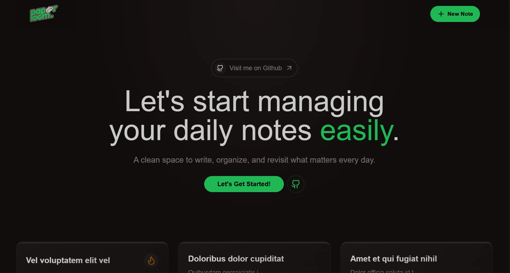

# Paperloom — Notes App

[](https://www.mongodb.com/)
[](https://expressjs.com/)
[](https://react.dev/)
[](https://nodejs.org/)

<a href="https://paperloom-production.up.railway.app/">



</a>

---

## 🌐 Live Demo

👉 **[Open Paperloom](https://paperloom-production.up.railway.app/)**  

---

Paperloom is a minimal **MERN stack notes app** to manage personal notes through simple CRUD flows.

- **Backend**: Node.js, Express, MongoDB (Mongoose)
- **Frontend**: React (Vite), React Router, react-hot-toast
- **Deployment**: Railway

The app provides a clean UI for creating, editing, deleting, and browsing notes.

---

## 📂 Project Structure

```
paperloom/
├─ backend/              # Express API (Notes CRUD, MongoDB, rate limiter)
│  ├─ src/
│  ├─ package.json
│  └─ .env.example
└─ frontend/             # React app (Vite, Router, UI components)
   ├─ src/
   ├─ index.html
   └─ package.json
```

---

## ⚙️ Local Setup

### Requirements
- Node.js 18+
- MongoDB (Atlas or local)

### Backend
```bash
cd backend
npm install
cp .env.example .env   # fill with your MongoDB URI and PORT
npm run dev
```

### Frontend
```bash
cd frontend
npm install
echo "VITE_API_BASE_URL=http://localhost:5000/api" > .env
npm run dev
```

---

## 📡 API Endpoints

Base URL (local): `http://localhost:5000/api/notes`  
Base URL (prod):  `https://paperloom-production.up.railway.app/api/notes`

| Method | Path   | Description    |
|------: |------- |----------------|
| GET    | `/`    | List all notes |
| POST   | `/`    | Create a note  |
| PUT    | `/:id` | Update a note  |
| DELETE | `/:id` | Delete a note  |

---
